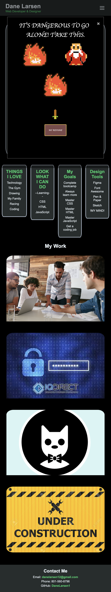

# Dane Larsen's Portfolio

Welcome to my personal portfolio website! This project showcases my skills as a web developer and designer, providing an overview of my work, skills, and a bit about me.

## Overview

This portfolio website serves as a digital resume and portfolio for me! A passionate web developer and designer. The site includes sections such as About Me, My Work, and Contact Me, providing visitors with insights into my background, skills, and projects.

## Features

- **Responsive Design:** The website is designed to be accessible and responsive across various devices.
- **Smooth Scrolling:** Enhanced user experience with smooth scrolling navigation.
- **Modal Interaction:** Tought myself some new code that engages users with an interactive modal that showcases additional content.
- **Work Showcase:** Highlight various projects, including descriptions and images.

## Technologies Used

- HTML
- CSS3
- JavaScript

## link to Deployed Site
http://127.0.0.1:5501/Danes-Portfolio/index.html#

## Image of Deployed Site

